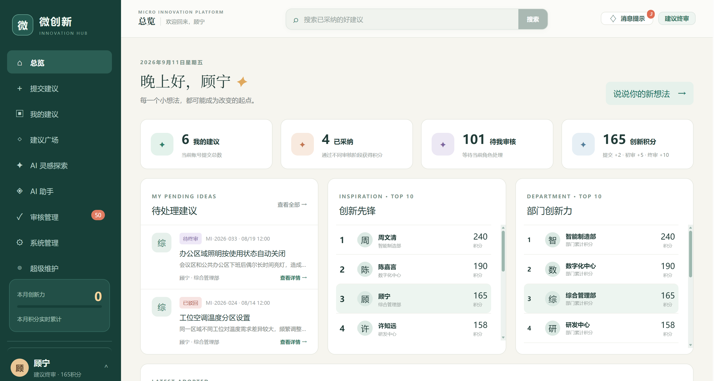
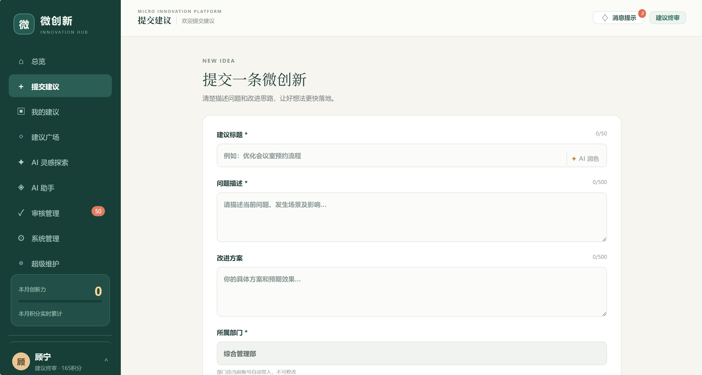
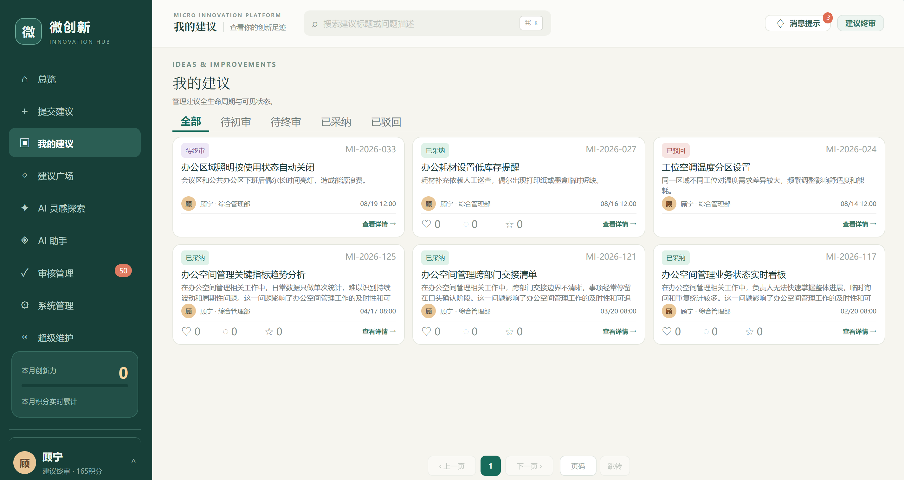
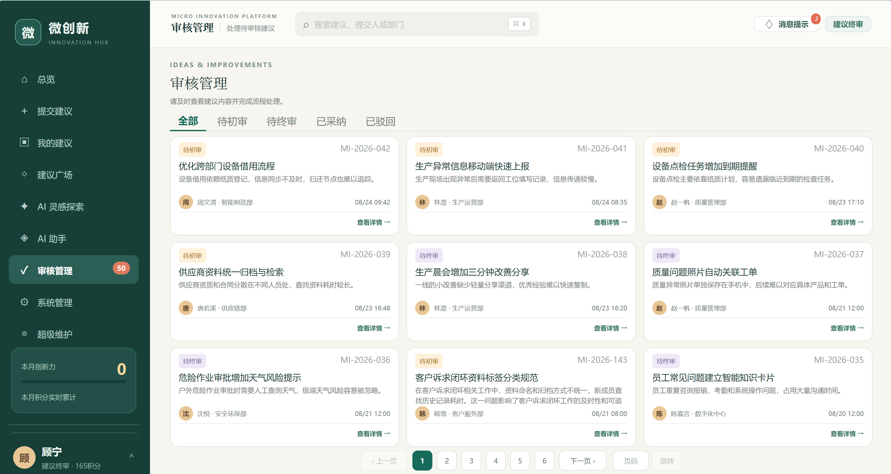
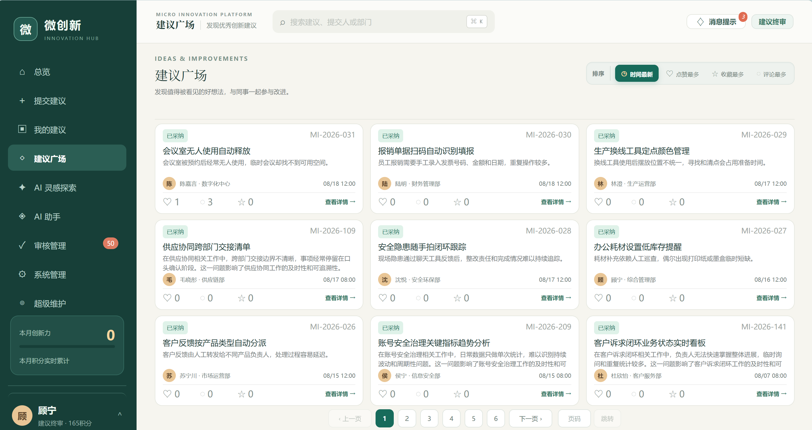
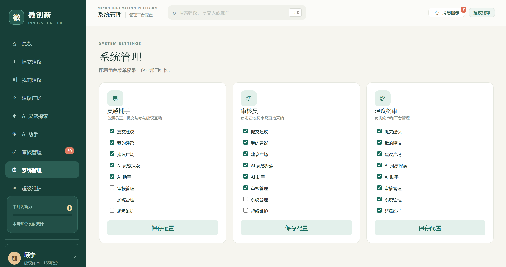
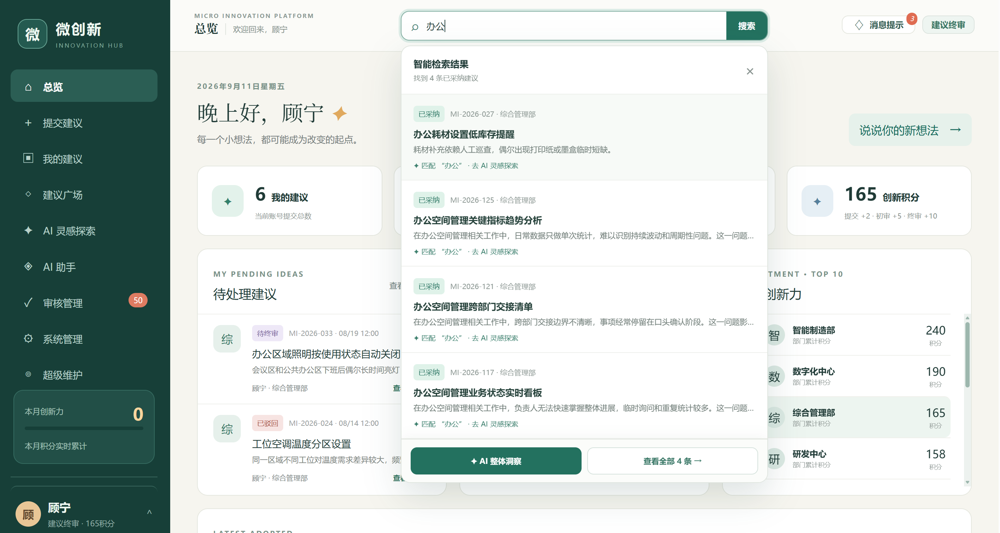
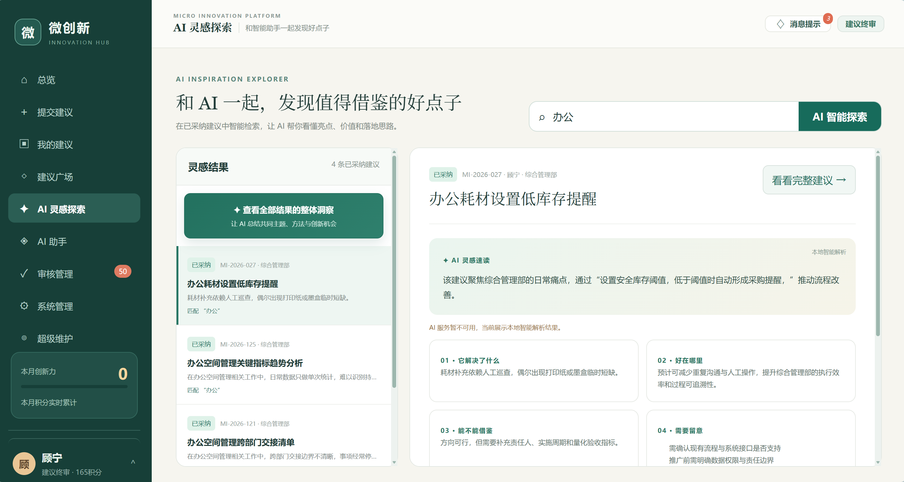
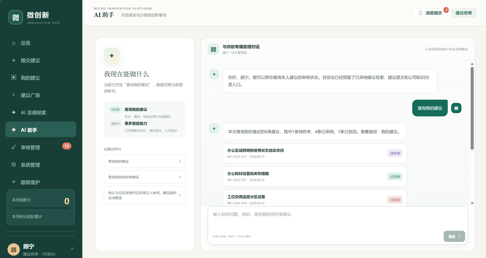
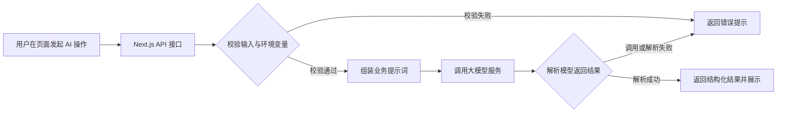

# 微创新平台

> 面向企业员工的微创新建议管理平台，让一线发现转化为可追踪、可审核、可传播的改进成果。

微创新平台为员工提供统一、低门槛的建议入口，围绕“发现问题 → 提出建议 → 审核采纳 → 公示复用 → 持续激励”建立业务闭环，推动优秀实践在组织内沉淀与推广。

## 功能概览

| 模块 | 说明 |
| --- | --- |
| 总览工作台 | 展示个人建议、待审核事项、创新积分、个人/部门排行榜与最新采纳建议。 |
| 建议管理 | 支持填写、提交、查看和修改建议，并跟踪待初审、待终审、已驳回、已采纳等状态。 |
| 建议广场 | 公示已采纳建议，支持搜索、点赞、收藏、评论与经验复用。 |
| 审核流转 | 支持初审、终审、退回调整及审核意见留痕。 |
| 激励体系 | 根据建议提交、初审通过和终审采纳等事件记录积分，形成个人及部门榜单。 |
| 平台管理 | 提供角色权限、部门配置、内容维护、数据导出与审计追溯能力。 |

平台角色包括：

- **灵感捕手**：提交和管理个人建议，浏览建议广场并参与互动。
- **建议初审**：处理权限范围内的待初审建议，可提交终审或退回调整。
- **建议终审**：完成终审采纳或退回，并承担系统管理与平台维护职责。

## 页面展示

### 总览

> **平台总览**  
> 展示建议数量、待审核事项、创新积分、排行榜及最新采纳内容。



### 建议提交与我的建议
> **提交建议**  
> 展示建议标题、问题描述、改进方案、附件及 AI 标题润色入口。



> **我的建议**  
> 展示已提交建议的状态。




### 审核与建议广场

> **审核管理**  
> 展示待初审、待终审建议及审核意见填写界面。




> **建议广场**  
> 展示已采纳建议的浏览、搜索、点赞、收藏和评论功能。



### 系统审核
> 用于角色分配模块权限




## 业务流程闭环

```text
发现问题
  ↓
提交建议（可补充附件）
  ↓
待初审 ──退回调整──→ 提交人修改并重新提交
  ↓
待终审 ──退回调整──→ 提交人修改并重新提交
  ↓
采纳并公示
  ↓
建议广场传播、互动与复用
  ↓
积分激励、个人/部门榜单沉淀
```

| 阶段 | 关键动作 | 价值 |
| --- | --- | --- |
| 建议提交 | 员工填写问题与改进方案，系统生成建议编号。 | 统一入口，降低创新表达门槛。 |
| 初审处理 | 初审人员提交终审或退回调整。 | 及时筛选和完善建议。 |
| 终审决策 | 终审人员采纳或退回，并记录意见。 | 明确决策责任，保证过程可追溯。 |
| 公示互动 | 已采纳建议进入建议广场。 | 促进经验传播与跨部门复用。 |
| 激励沉淀 | 系统记录积分并生成排行榜。 | 形成持续参与的正向循环。 |

## AI 功能

AI 能力嵌入建议撰写、阅读与分析环节，为员工和审核人员提供辅助参考；最终内容与业务决策仍以人工确认为准。

| 能力 | 使用场景 | 输出内容 |
| --- | --- | --- |
| AI 标题润色 | 优化员工输入的建议标题。 | 清晰、简洁、专业且具有行动导向的标题。 |
| 智能阅读 | 快速理解单条建议。 | 建议摘要、核心问题和建议行动。 |
| 建议分析 | 评估建议的价值与实施要点。 | 问题分析、预期价值、可行性、风险及下一步建议。 |
| 多建议洞察 | 归纳多条已采纳建议。 | 高频主题、共性做法和潜在创新机会。 |
| AI 对话助理 | 查询个人建议，或通过对话引导创建建议。 | 建议查询结果、结构化表单和提交确认。 |

### AI 页面展示

> **AI 功能**  
> 展示 AI 标题润色（提交建议模块）、智能阅读、建议分析或 AI 对话助理页面。





### AI 实现逻辑

平台 AI 能力采用“**页面调用 → 服务端校验与编排 → 模型生成 → 结构化结果展示**”的处理方式。浏览器不会直接持有模型密钥，所有模型请求均由服务端接口代理完成。



#### 页面 AI 接口

| 功能 | 服务端接口 | 输入校验与处理逻辑 | 返回结果 |
| --- | --- | --- | --- |
| 标题润色 | `POST /api/polish-title` | 校验标题非空且不超过 50 字；提示模型仅优化原意，不补充虚构信息。 | 单个润色后的标题。 |
| 智能阅读 | `POST /api/smart-read` | 校验建议标题和问题描述；以低随机性生成简洁 JSON。 | `summary`、`problem`、`action`。 |
| 建议分析 | `POST /api/analyze-idea` | 基于单条建议分析问题、价值、可行性和风险；禁止编造具体收益。 | 概述、问题、价值、可行性、风险和下一步建议。 |
| 整体洞察 | `POST /api/summarize-ideas` | 对最多 20 条建议进行归纳，提炼主题与共性做法。 | 总结、高频主题、共性做法和创新机会。 |

上述接口统一从环境变量读取 `API_KEY` 和 `OPENAI_MODEL`；缺少配置、上游服务异常或返回内容无法解析时，会返回明确错误提示，不影响平台的提交、审核等基础业务流程。

#### AI 对话助理

独立的 `ai-service` 基于 FastAPI 和 LangGraph 提供 `POST /api/chat` 接口。其工作流如下：

1. 根据用户消息中的关键词进行意图识别，当前支持“查询我的建议”“创建/补全建议”等场景。
2. 查询类请求仅读取当前用户的建议数据，并返回状态、最新反馈及页面跳转信息。
3. 创建类请求从自然语言中提取标题、建议内容和改进方案；配置大模型时优先使用模型进行结构化抽取，未配置或调用失败时自动降级为规则提取。
4. 字段未填完整时，引导用户继续补充；内容完整后先展示预览，只有收到“确认提交”等明确指令后才调用本地数据服务创建建议。

> 当前“查询已采纳建议”和知识问答意图仅完成识别与提示，RAG 检索和企业知识库接入为后续迭代能力。

#### 数据与安全边界

- 密钥仅存放于 `.env.local` 或部署环境变量，禁止写入前端代码、截图或 Git 仓库。
- AI 返回内容采用固定字段的 JSON 格式解析，减少自由文本输出对页面渲染的影响。
- AI 结果为辅助意见；建议提交、审核流转和最终采纳均由用户或审核人员确认。
- 对话助理通过 `X-User-Id` 识别当前用户；生产环境应由可信服务端根据登录态注入该值，不能由浏览器自行指定。

## 快速开始

### 环境要求

- Node.js `>= 22.13.0`
- pnpm
- Python `>= 3.11`（仅在运行 `ai-service` 时需要）

### 启动前端与本地数据服务

```bash
pnpm install
pnpm dev
```

启动后访问 [http://localhost:3000](http://localhost:3000)。`pnpm dev` 会同时启动前端服务和本地 SQLite 数据服务（端口 `3001`）。

### 配置 AI 能力（可选）

在项目根目录创建 `.env.local`，并配置：

```dotenv
API_KEY=your_api_key
OPENAI_MODEL=your_model_name
```

未配置 AI 服务时，平台的基础建议与审核流程仍可正常使用；相关 AI 操作会提示服务尚未配置。

### 启动 AI 对话服务（可选）

```bash
cd ai-service
python -m venv .venv
.venv\Scripts\python -m pip install -e ".[dev]"
.venv\Scripts\python -m uvicorn app.main:app --reload --port 8000
```

## 项目结构

```text
micro-innovation-platform/
├── app/                    # 前端页面、接口与数据访问逻辑
├── ai-service/             # 独立的 AI 对话助理服务
├── data/                   # 本地 SQLite 数据库与初始化数据
├── images/                 # README 页面截图
├── scripts/                # 本地开发与数据服务脚本
└── package.json            # 前端项目配置
```

## 技术栈

- **前端**：React、Next.js / Vinext、TypeScript
- **本地数据服务**：Node.js、SQLite
- **AI 服务**：FastAPI、LangGraph、Pydantic

## 说明

- 当前项目使用本地 SQLite 数据库，适合演示和开发联调；生产使用前应接入企业统一认证、持久化数据库、对象存储和审计能力。
- API 密钥仅应配置在服务端环境变量中，请勿提交 `.env.local`、真实密钥或敏感业务数据到仓库。
- 建议补充 `LICENSE`、贡献规范和变更日志后，再作为公开或多人协作仓库长期维护。
